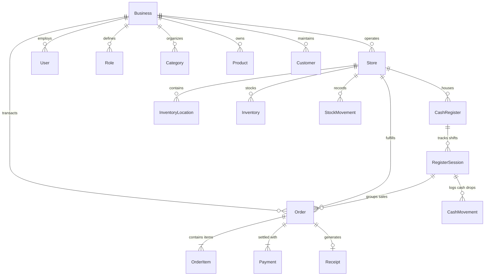

# Enterprise POS Database Architecture & Relationships

This document details the relational architecture, data integrity rules, indexing strategies, and multi-tenant design of the Point of Sale PostgreSQL database managed via **Prisma ORM**.

---

## 🏛️ Multi-Business & Multi-Store Hierarchy

The database is built from the ground up to support multiple businesses (multi-tenant) and multiple stores/branches per business without requiring schema alterations or migration changes.

---

## 🔑 Core Model Relationships

### 1. Multi-Store Tenancy

- **`Business`**: Represents the top-level commercial enterprise (e.g., "Angkor Fresh Mart Co., Ltd."). Governs global settings such as `defaultCurrency` ("USD"), `baseExchangeRate` (4,100 KHR/USD), and `timezone` (`Asia/Phnom_Penh`).
- **`Store`**: Represents a physical retail location, outlet, or branch linked to a `Business` via `businessId`. Stores own cash registers, inventory locations, stock levels, and localized receipt headers/footers.

### 2. User Authentication & Granular RBAC

- **`User`**: Cashiers, store managers, and administrators belong to a `Business`. Sensitive authentication fields store hashed credentials (`passwordHash` and fast 4–6 digit `pinCodeHash` for touchscreen register unlocks).
- **`Role` & `Permission`**: Roles (e.g., `ADMIN`, `MANAGER`, `CASHIER`) are linked to granular permissions (`orders:create`, `orders:refund`, `inventory:adjust`, `reports:view`) through the `RolePermission` join table.
- **`UserRole`**: Maps a `User` to a `Role` with optional store-level scoping (`storeId`). A user can be a Cashier in Store A, or an Admin globally across all stores.

### 3. Catalog & Products

- **`Category`**: Self-referential hierarchy (`parentId`) allowing nested product categorization (e.g., _Beverages -> Cold Drinks_). Includes color and icon tokens for touch POS tiles.
- **`Product` & `ProductVariant`**:
  - `Product`: Core catalog item with master SKU, barcode, cost price, and dual-currency selling prices.
  - `ProductVariant`: Handles specific variants (e.g., sizes, flavors, colors) sharing parent product attributes but with unique barcodes and pricing.

### 4. Inventory, Locations & Stock Movements

- **`InventoryLocation`**: Specific storage zones within a store (e.g., "Sales Floor Shelves", "Backroom Warehouse", "Cold Storage").
- **`Inventory`**: Quantitative stock tracking per store, location, and product/variant.
- **`StockMovement`**: Immutable audit ledger recording every inventory alteration (`SALE`, `REFUND`, `PURCHASE`, `ADJUSTMENT_IN`, `ADJUSTMENT_OUT`, `DAMAGE`). Captures `quantityBefore`, `quantityChange`, `quantityAfter`, and links to the responsible user and originating transaction (`referenceId`).

### 5. Orders, Order Items, Payments & Receipts

- **`Order`**: Comprehensive sales transaction record. Holds server-validated monetary subtotals, discounts, tax amounts, and change calculations.
- **`OrderItem`**: Snapshot of purchased items at the moment of sale, preserving historic unit prices and costs against future catalog price adjustments.
- **`Payment`**: One or more payment tenders per order, enabling split payments (e.g., partial cash + partial KHQR). Linked to configured `PaymentMethod` (Cash, KHQR/ABA, Card, Bank Transfer).
- **`Receipt`**: Unique receipt identifier and printable metadata linked 1-to-1 with an order.

### 6. Cash Registers, Sessions & Drawer Auditing

- **`CashRegister`**: Physical POS terminal hardware or checkout counter.
- **`RegisterSession`**: Cashier shift lifecycle. Records `openingFloat` (USD & KHR), tracks sales and mid-shift cash movements, and reconciles expected cash vs. counted cash upon shift close (`differenceUSD`, `differenceKHR`).
- **`CashMovement`**: Logs manual cash drawer interactions (`CASH_IN`, `CASH_OUT`, `FLOAT_ADD`, `PAY_OUT`) with mandatory reasons.

### 7. Governance, Audit & Offline Sync

- **`AuditLog`**: Tamper-evident ledger recording critical business events (`ORDER_CREATED`, `STOCK_ADJUSTED`, `SESSION_CLOSED`) with user, IP address, and JSON metadata.
- **`Device` & `SyncQueue`**: Tracks authorized POS terminals and queues offline client transactions with unique client UUIDs (`clientSyncId`) to guarantee idempotent offline synchronization.

---

## 💰 Safe Money Representation

**No floating-point numbers (`Float` / `Double`) are used for currency or pricing.** Floating-point arithmetic introduces rounding inaccuracies (e.g. `0.1 + 0.2 = 0.30000000000000004`).

All financial and quantitative fields use PostgreSQL `DECIMAL` types via Prisma:

- **Currency & Amounts**: `Decimal @db.Decimal(12, 2)` (supports values up to 9,999,999,999.99 with exact cent precision).
- **Exchange Rates & Tax Rates**: `Decimal @db.Decimal(12, 4)` and `@db.Decimal(6, 4)` (e.g., `4100.0000` KHR/USD exchange rate, `0.1000` for 10% VAT).
- **Inventory Quantities**: `Decimal @db.Decimal(12, 3)` (supports fractional units such as kilograms, liters, or grams to 3 decimal places).

---

## ⚡ High-Frequency POS Query Optimization & Indexes

The schema incorporates dedicated B-tree and unique indexes tailored for millisecond POS response times:

| Query Pattern              | Indexed Fields                                                   | Purpose                                                      |
| :------------------------- | :--------------------------------------------------------------- | :----------------------------------------------------------- |
| **Barcode Scan**           | `products(barcode)`, `product_variants(barcode)`                 | Instant sub-5ms product resolution on hardware scanner input |
| **SKU Search**             | `products(businessId, sku)`, `product_variants(productId, sku)`  | Rapid manual code entry                                      |
| **Product Search**         | `products(businessId, name)`                                     | Fast autocomplete on POS catalog search                      |
| **Category Browsing**      | `products(categoryId)`                                           | Instant category tab switching                               |
| **Customer Lookup**        | `customers(phone)`, `customers(businessId, name)`                | Fast lookup during customer identification at checkout       |
| **Sales Reporting**        | `orders(storeId, createdAt)`, `orders(createdAt)`                | High-speed date range aggregations and daily shift summaries |
| **Order Inquiries**        | `orders(orderNumber)`, `orders(customerId)`, `orders(sessionId)` | Immediate order retrieval for refunds and receipt reprints   |
| **Inventory Verification** | `inventory(storeId, locationId, productId)`                      | Real-time stock availability check during checkout           |
| **Shift Management**       | `register_sessions(registerId, status)`                          | Instant lookup of currently active cashier session           |

---

## 🛡️ Data Integrity & Soft Deletes

- **Cascading Constraints**: Structural entities cleanly cascade deletions when a parent is removed (e.g. deleting a `Store` removes its local `Inventory` and `CashRegisters`).
- **Restricted Foreign Keys**: Transactional and inventory movements enforce `onDelete: Restrict` on `Product` and `User` references, preventing orphan records or accidental deletion of sold inventory.
- **Soft Deletes**: Key catalog entities (`Product`, `ProductVariant`, `Category`, `Brand`, `Supplier`, `Customer`, `Store`, `Business`) feature `deletedAt DateTime?` timestamps, allowing safe archiving without breaking historic order items or financial reporting.
